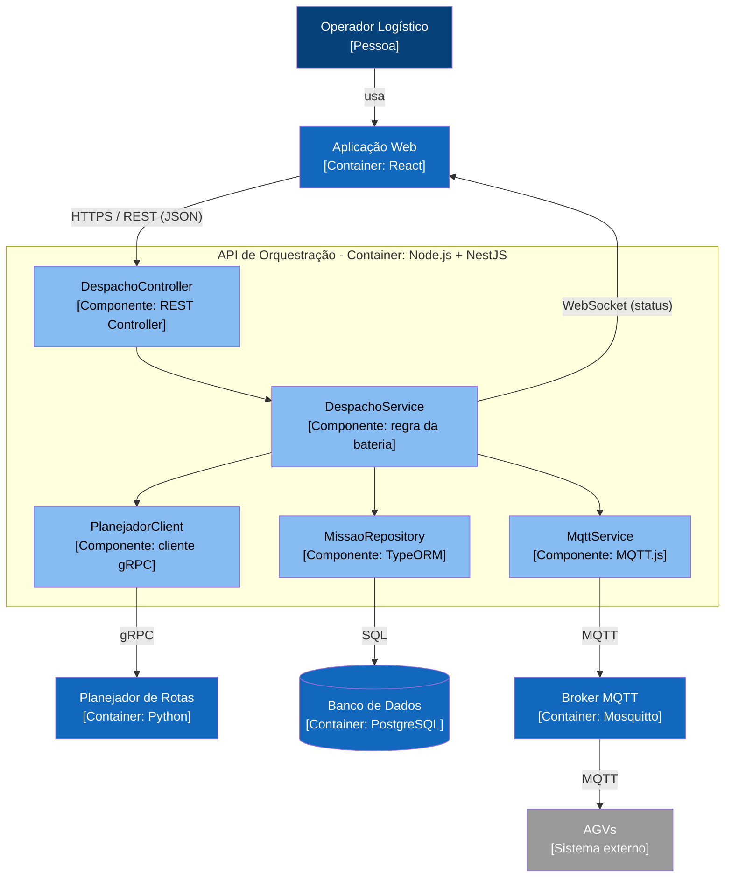

# C4 Nível 3 - Componentes da API de Orquestração (parte do despacho)

```mermaid
flowchart TB
    op["Operador Logístico<br/>[Pessoa]"]
    web["Aplicação Web<br/>[Container: React]"]

    subgraph api[API de Orquestração - Container: Node.js + NestJS]
        ctrl["DespachoController<br/>[Componente: REST Controller]"]
        svc["DespachoService<br/>[Componente: regra da bateria]"]
        repo["MissaoRepository<br/>[Componente: TypeORM]"]
        cliente["PlanejadorClient<br/>[Componente: cliente gRPC]"]
        mqttpub["MqttService<br/>[Componente: MQTT.js]"]
    end

    planejador["Planejador de Rotas<br/>[Container: Python]"]
    bd[("Banco de Dados<br/>[Container: PostgreSQL]")]
    broker["Broker MQTT<br/>[Container: Mosquitto]"]
    agv["AGVs<br/>[Sistema externo]"]

    op -->|usa| web
    web -->|"HTTPS / REST (JSON)"| ctrl
    ctrl --> svc
    svc --> repo
    svc --> cliente
    svc --> mqttpub
    repo -->|SQL| bd
    cliente -->|gRPC| planejador
    mqttpub -->|MQTT| broker
    broker -->|MQTT| agv
    svc -->|"WebSocket (status)"| web

    classDef pessoa fill:#08427b,color:#fff
    classDef container fill:#1168bd,color:#fff
    classDef comp fill:#85bbf0,color:#000
    classDef ext fill:#999,color:#fff
    class op pessoa
    class web,planejador,bd,broker container
    class ctrl,svc,repo,cliente,mqttpub comp
    class agv ext
```
