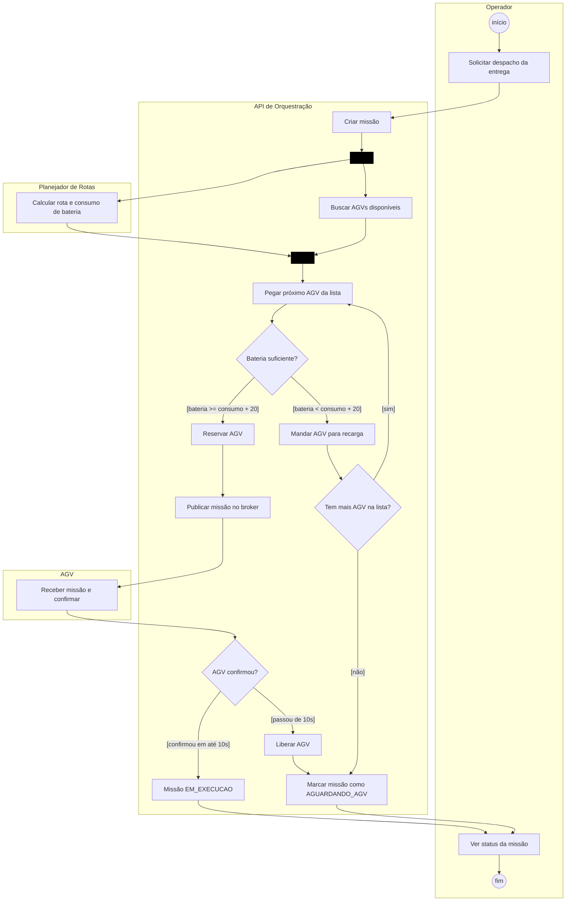

# Diagrama de Atividades - Despacho de Missão

As barras pretas são o fork e o join: o cálculo da rota e a busca dos AGVs acontecem ao mesmo tempo.

```mermaid
flowchart TB
    subgraph R1[Operador]
        I((início))
        A1[Solicitar despacho da entrega]
        A2[Ver status da missão]
        F((fim))
    end

    subgraph R2[API de Orquestração]
        B1[Criar missão]
        FORK[ ]:::barra
        B2[Buscar AGVs disponíveis]
        JOIN[ ]:::barra
        B3[Pegar próximo AGV da lista]
        D1{Bateria suficiente?}
        B4[Reservar AGV]
        B5[Mandar AGV para recarga]
        D2{Tem mais AGV na lista?}
        B6[Marcar missão como AGUARDANDO_AGV]
        B7[Publicar missão no broker]
        D3{AGV confirmou?}
        B8[Missão EM_EXECUCAO]
        B9[Liberar AGV]
    end

    subgraph R3[Planejador de Rotas]
        C1[Calcular rota e consumo de bateria]
    end

    subgraph R4[AGV]
        G1[Receber missão e confirmar]
    end

    I --> A1 --> B1 --> FORK
    FORK --> C1 --> JOIN
    FORK --> B2 --> JOIN
    JOIN --> B3 --> D1
    D1 -->|"[bateria >= consumo + 20]"| B4 --> B7
    D1 -->|"[bateria < consumo + 20]"| B5 --> D2
    D2 -->|"[sim]"| B3
    D2 -->|"[não]"| B6 --> A2
    B7 --> G1 --> D3
    D3 -->|"[confirmou em até 10s]"| B8 --> A2
    D3 -->|"[passou de 10s]"| B9 --> B6
    A2 --> F

    classDef barra fill:#000,stroke:#000,color:#000
```
