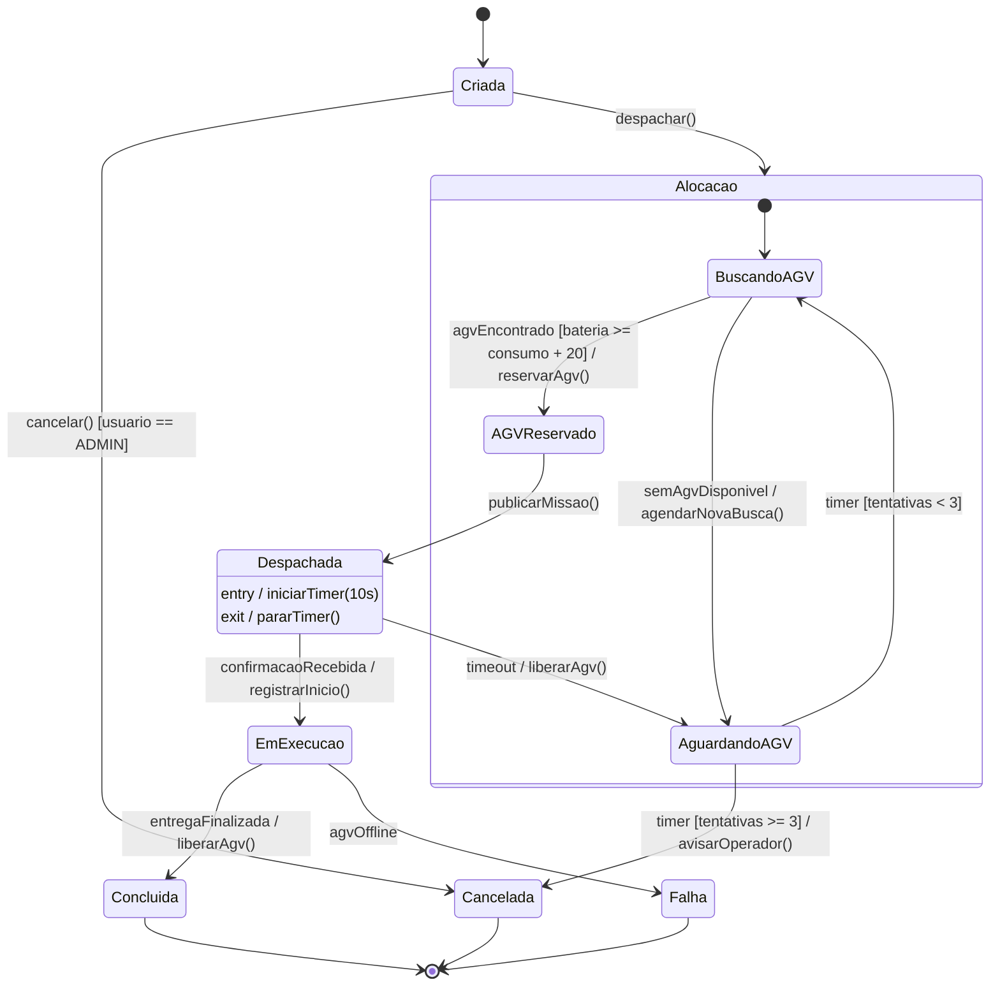

# Diagrama de Estados - MissaoAGV

```mermaid
stateDiagram-v2
    [*] --> Criada

    Criada --> Alocacao : despachar()
    Criada --> Cancelada : cancelar() [usuario == ADMIN]

    state Alocacao {
        [*] --> BuscandoAGV
        BuscandoAGV --> AGVReservado : agvEncontrado [bateria >= consumo + 20] / reservarAgv()
        BuscandoAGV --> AguardandoAGV : semAgvDisponivel / agendarNovaBusca()
        AguardandoAGV --> BuscandoAGV : timer [tentativas < 3]
    }

    AguardandoAGV --> Cancelada : timer [tentativas >= 3] / avisarOperador()
    AGVReservado --> Despachada : publicarMissao()

    state "Despachada" as Despachada
    Despachada : entry / iniciarTimer(10s)
    Despachada : exit / pararTimer()

    Despachada --> EmExecucao : confirmacaoRecebida / registrarInicio()
    Despachada --> AguardandoAGV : timeout / liberarAgv()

    EmExecucao --> Concluida : entregaFinalizada / liberarAgv()
    EmExecucao --> Falha : agvOffline

    Concluida --> [*]
    Cancelada --> [*]
    Falha --> [*]
```
