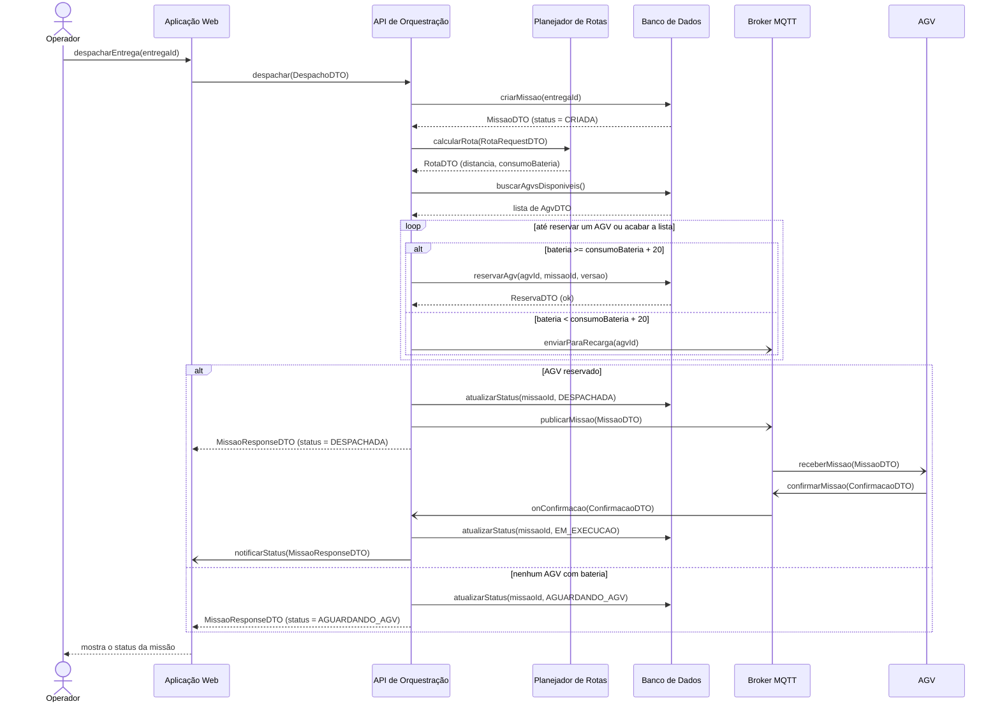

# Diagrama de Sequência - Despacho de Missão

Fluxo de quando o operador manda despachar uma entrega e o sistema escolhe um AGV com bateria suficiente.

```mermaid
sequenceDiagram
    actor Operador
    participant Web as Aplicação Web
    participant API as API de Orquestração
    participant Planejador as Planejador de Rotas
    participant BD as Banco de Dados
    participant Broker as Broker MQTT
    participant AGV

    Operador->>Web: despacharEntrega(entregaId)
    Web->>API: despachar(DespachoDTO)
    API->>BD: criarMissao(entregaId)
    BD-->>API: MissaoDTO (status = CRIADA)

    API->>Planejador: calcularRota(RotaRequestDTO)
    Planejador-->>API: RotaDTO (distancia, consumoBateria)

    API->>BD: buscarAgvsDisponiveis()
    BD-->>API: lista de AgvDTO

    loop até reservar um AGV ou acabar a lista
        alt bateria >= consumoBateria + 20
            API->>BD: reservarAgv(agvId, missaoId, versao)
            BD-->>API: ReservaDTO (ok)
        else bateria < consumoBateria + 20
            API-)Broker: enviarParaRecarga(agvId)
        end
    end

    alt AGV reservado
        API->>BD: atualizarStatus(missaoId, DESPACHADA)
        API-)Broker: publicarMissao(MissaoDTO)
        API-->>Web: MissaoResponseDTO (status = DESPACHADA)
        Broker-)AGV: receberMissao(MissaoDTO)
        AGV-)Broker: confirmarMissao(ConfirmacaoDTO)
        Broker-)API: onConfirmacao(ConfirmacaoDTO)
        API->>BD: atualizarStatus(missaoId, EM_EXECUCAO)
        API-)Web: notificarStatus(MissaoResponseDTO)
    else nenhum AGV com bateria
        API->>BD: atualizarStatus(missaoId, AGUARDANDO_AGV)
        API-->>Web: MissaoResponseDTO (status = AGUARDANDO_AGV)
    end

    Web-->>Operador: mostra o status da missão
```
